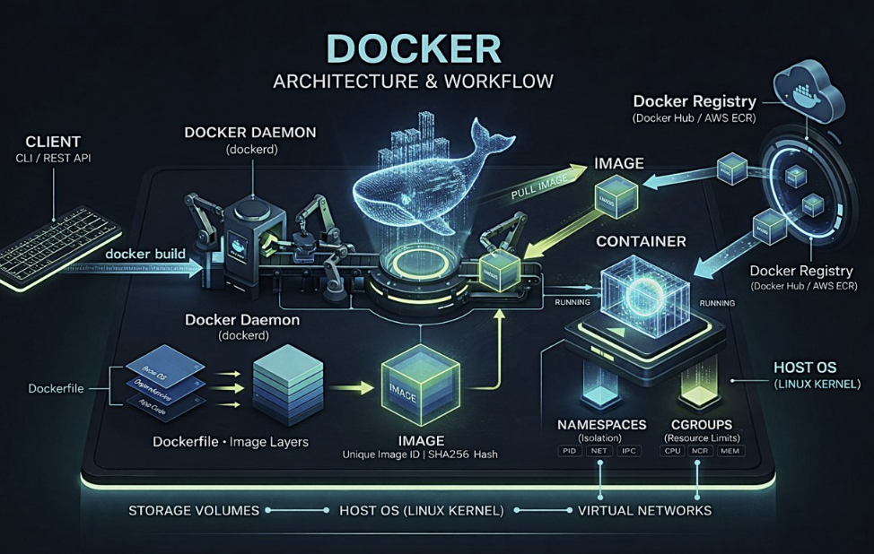
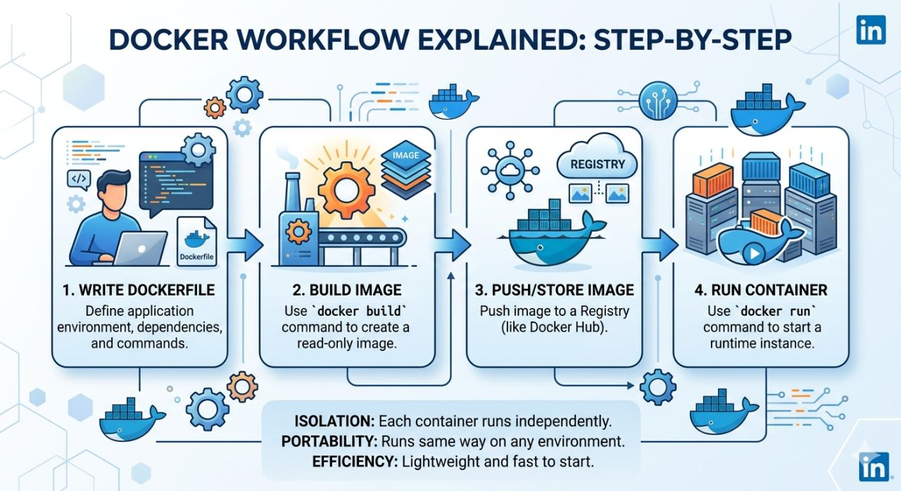

## 🔹 Docker

- It is a container platform to develop, build, ship, and run applications.
- It is open-source and developers run apps inside containers.
  
---

## 🔹 Container

- Docker run apps in an isolated environment called a container.
- It is a lightweight package with everything needed to run an app.
- It includes: code, dependencies, libraries, and runtime.
  
---

## 🔹 Main Components of Dokcer

### Docker File

- A file with instructions.
- It tells Docker how to create an image.

### Docker Image

- It is a blueprint of a container.
- Single file with all the dependencies and libraries to run the program.
- Containers are created from images.

### Docker Registry

- A place to store Docker images.
- You can upload and download images from here.

### Docker Hub

- A popular online registry.
- Developers use it to share and download images.
  
---

**Dockerfile → builds → Image → runs as → Container → stored in → Registry**

---

- Dockerfile → makes → Image
- Image → runs as → Container
- Images → stored in → Registry (like Docker Hub)

---

## 🔹 Docker Architecture



Docker Uses Client-Server Architecture.

### 1. Docker Client

- Where you type Docker commands.
- Examples:
  - docker build
  - docker run
- Sends requests to Docker Engine (Daemon).

### 2. Docker Daemon (Docker Engine)

- Main service that does the work.
- Builds Docker images.
- Creates and runs containers.
- Manages Docker resources.
  
### 3. Dockerfile → Image

- Dockerfile is a text file with instructions.
- Docker reads the Dockerfile and creates an Image.

### 4. Image → Container
- Image = Blueprint of an application.
- Container = Running instance of an image.
- When you run an image, Docker creates a container.

### 5. Docker Registry
- Online storage for Docker images.
- Example: Docker Hub
- Used to:
   - Pull = Download images
   - Push = Upload images

### Simple Flow
```bash
Docker Client
      ↓
Docker Daemon
      ↓
Dockerfile → Image
      ↓
    Container
      ↑
Docker Registry (Pull / Push Images)
```

- Docker uses a client-server architecture where the Docker Client sends commands to the Docker Daemon. The Daemon builds images from Dockerfiles, runs containers, and can pull/push images from a Docker Registry.
---

## 🔹 Docker Workflow

  

- First, write a Dockerfile.
- Then, build an image using docker build.
- Next, push the image to a registry like Docker Hub.
- Finally, run the image as a container using docker run.
  
👉 Flow:

Write → Build → Push → Run
