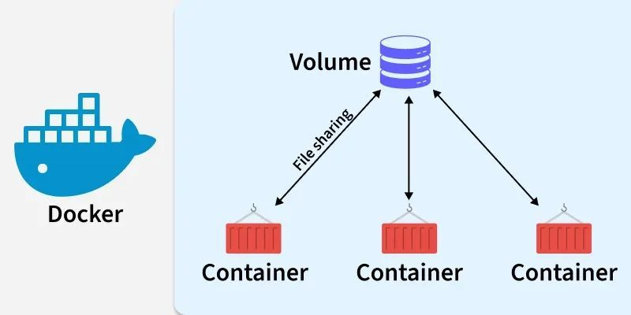

## Docker Volumes

- A Docker Volume is a storage mechanism used to persist data outside a container. 
- This ensures that data is not lost when a container is stopped, deleted, or recreated.
  

---

## Example

Suppose a PostgreSQL container stores customer data.

- Without a volume: If the container is deleted, all database data is lost.
- With a volume: The data is stored separately and remains available even if the container is recreated.

---

## Why use Docker Volumes?

- Persistent data storage
- Data sharing between containers
- Easy backup and migration
- Commonly used for databases, logs, and uploaded files

---

##  Types of Storage in Docker

- **Volumes (Recommended)**
- **Bind Mounts**
- **tmpfs** (temporary, in-memory storage)
